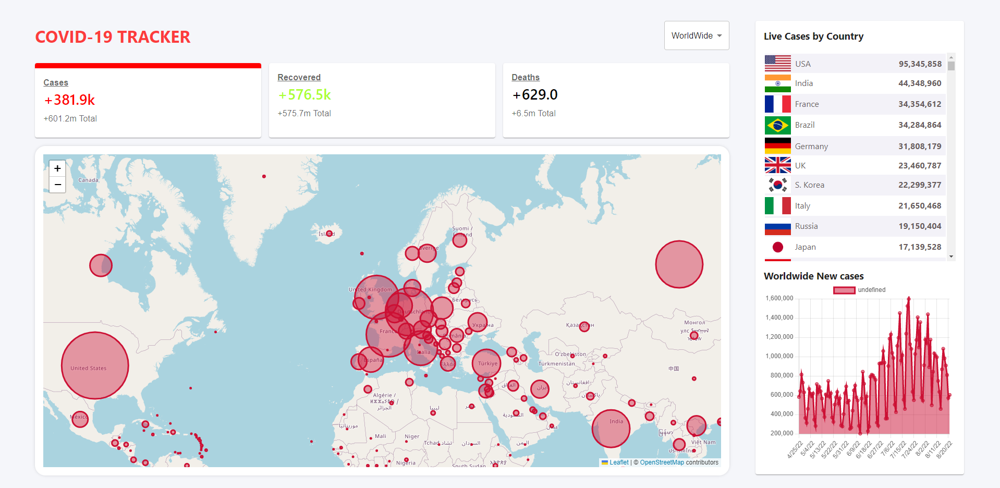
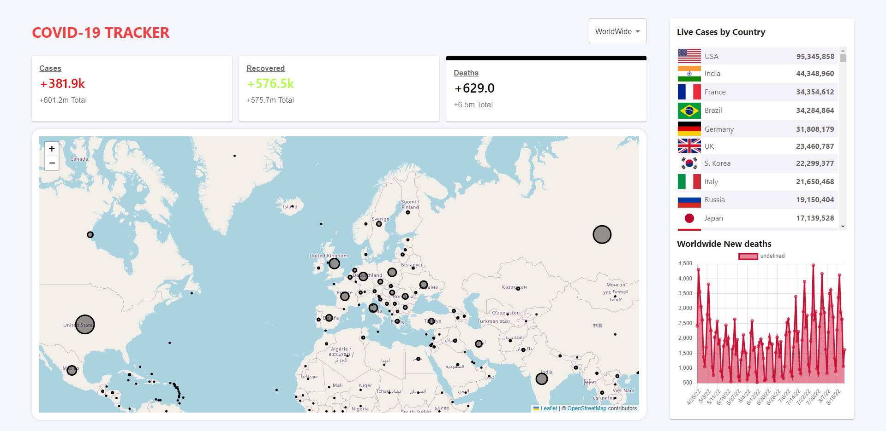
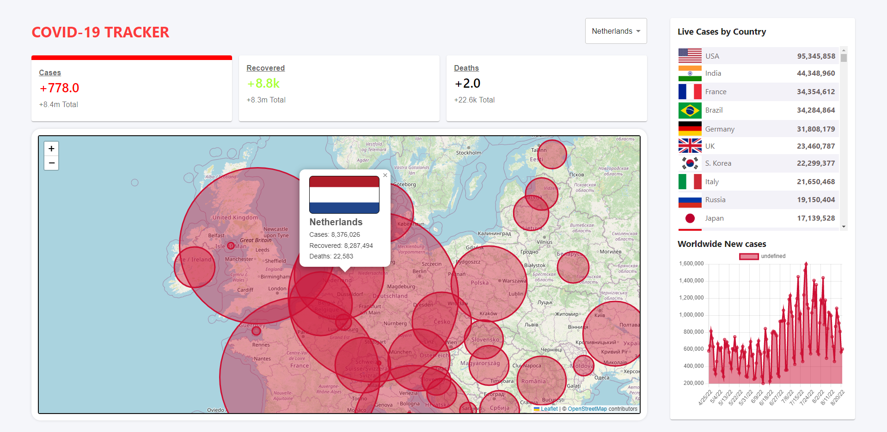
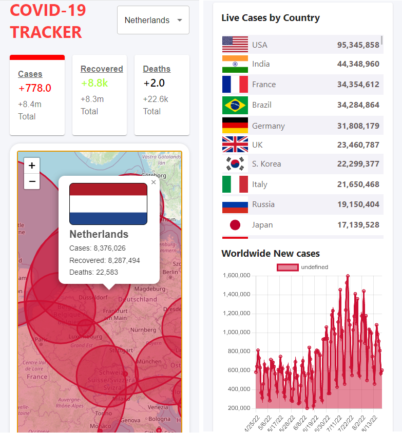

# Covid-19-Tracker
<!-- ABOUT THE PROJECT -->
## About The Project

You can check worldwide or each country covid-19 status with [Covid-19-Tracker](https://covid-19-tracker-26330.web.app/) application. You can interact with the map or select the status type; Cases, Recovered, and Deaths, as well as can see the numbers of cases in order from largest to smallest for each country. I developed this application using React.js, React-Leaflet, React-Chart.js, and Material-UI. If you want to examine data that I used to develop Covid-19-Tracker, here is the website https://disease.sh.

### Project Images










### Built With

* [React.js](https://reactjs.org/)
* [Material-UI](https://mui.com/)
* [React-Leaflet](https://react-leaflet.js.org/)
* [React-Chart.js](https://react-chartjs-2.js.org/)

<p align="right">(<a href="#top">back to top</a>)</p>

<!-- GETTING STARTED -->
## Getting Started

To get a local copy up and running follow these simple steps.

### Prerequisites

You need to install prerequisites before running the project. Please write the following code snips on your terminal.
* npm

  ```sh
  npm install npm@latest -g
  ```

### Installation

1. Clone the repo

   ```sh
   git clone https://github.com/dyakupoglu/Covid-19-Tracker.git
   ```
2. Install NPM packages on both client and server side

   ```sh
   npm install
   ```

<p align="right">(<a href="#top">back to top</a>)</p>

## License

Licensed under the [MIT License](https://github.com/dyakupoglu/Covid-19-Tracker/blob/main/LICENSE)

<p align="right">(<a href="#top">back to top</a>)</p>